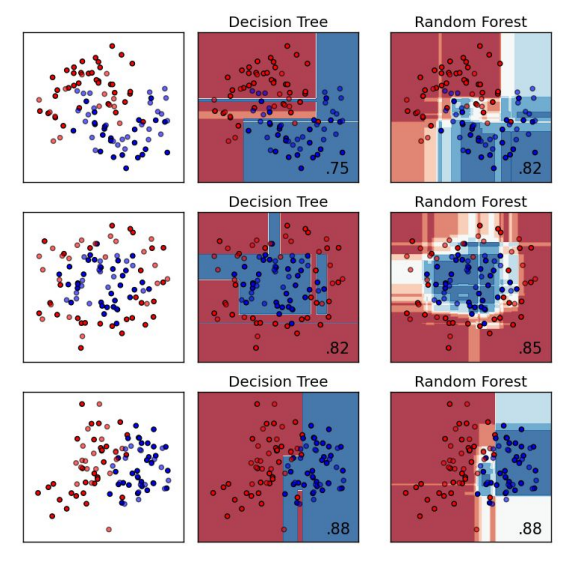

# Proyecto de Clasificación de Calidad de Vinos

## Definición del problema
El objetivo es predecir la calidad del vino en una escala del 0 al 10, utilizando las variables químicas como puede ser el PH, alcohol y acidez. permitiendo a los productores/laboratorios tomar decisiones mas informadas y automatizadas de los procesos de producción para poder predecir si el vino será calidad alta, media o baja, de esta manera puede ayudar a tomar decisiones sobre reducir costos o mejorar la eficiencia en la produccion de vinos.

# Plan de Acción
## Explicación del Dataset
El dataset tiene 12 columnas, 11 características y 1 que es la variable objetivo.

Teniendo dos archivos, winequality-red y winequality-white, cada una representa una muestra de vino con sus propiedades y calidad asignada por catadores.
### Features del Dataset

**Fixed acidity**: Concentración de ácidos no volátiles, principalmente ácido tartárico y málico, que contribuyen a la acidez total del vino.

**Volatile acidity**: Medida de ácidos volátiles, principalmente ácido acético, que en exceso puede generar sabores desagradables.

**Citric acid**: Cantidad de ácido cítrico, que puede aportar frescura y sabor al vino.

**Residual sugar**: Cantidad de azúcar residual después de la fermentación (g/l), relacionada con el dulzor del vino.

**Chlorides**: Concentración de cloruros (sales) en el vino.

**Free sulfur dioxide**: Cantidad de dióxido de azufre libre, utilizado para prevenir el crecimiento de microorganismos.

**Total sulfur dioxide**: Cantidad total de dióxido de azufre presente, incluyendo formas combinadas y libres.

**Density**: Densidad del vino, relacionada con su contenido de azúcar y alcohol.

**PH**: Medida de acidez o alcalinidad del vino.

**Sulphates**: Cantidad de sulfatos, que contribuyen a la estabilidad microbiana y el sabor del vino.

**Alcohol**: Porcentaje de alcohol por volumen presente en el vino.

**Quality**: Puntuación de calidad del vino, asignada por catadores en una escala de 0 a 10 (variable objetivo).

---

## MODELO RANDOM FOREST 

### Justificación del Modelo

Como dentro del proyecto se hará para predecir sobre la calidad del vino a partir de sus propiedades físico-químicas, entonces la elección de hacerlo mediante el Random Forest ya que como el dataset presenta multiples variables numéricas, una de las ventaja importante de Random Forest, es que puede determinar la importancia de cada variable y descubrir relaciones complejas entre ellas o que permite identificar cuáles son los factores más influyentes en la calidad del vino, generando así interpretaciones útiles para la industria, lo realiza mediante la observación la disminución en la impureza de Gini/Entropy y promediando esta disminución por cada Feature así se puede ver qué tan importante
es esa feature para dividir los datos en diferentes ramas.

Por lo cual al comparar con otros modelos como la regresión logística o modelos más sensibles a la escala y ruido como KNN, Random Forest ofrece como modelo una solución más estable y precisa así mismo, a diferencia de la regresión logística, Random Forest no requiere asumir relaciones lineales entre variables y calidad, lo que lo hace más adecuado para este problema.

### Limitaciones del modelo

Si bien este modelo cuenta con múltiples ventajas, tambien tiene desventajas por ejemplo dentro de las limitaciones es que no tiene una alta interpretabilidad como lo podría hacer un arbol de decisión, tambien sabemos que al momento de entrenar este modelo requiere de un poco mas de tiempo y esto demora aún más cuando el dataset es de un tamaño considerable.

