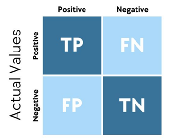
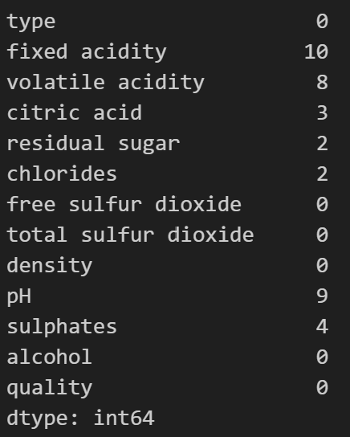
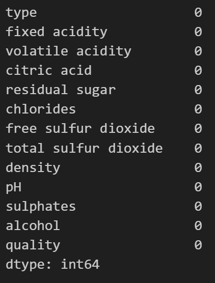
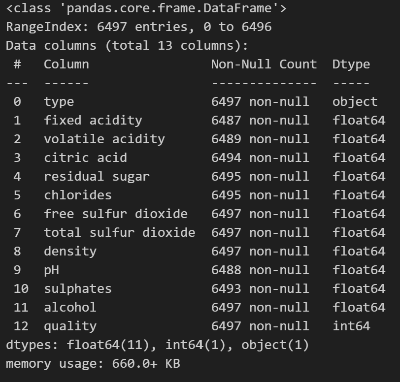
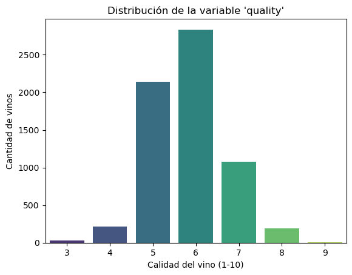
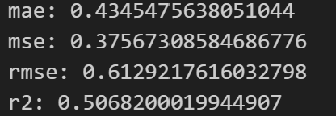

# Proyecto de Clasificación de Calidad de Vinos

## Definición del problema
El objetivo es predecir la calidad del vino en una escala del 0 al 10, utilizando las variables químicas como puede ser el PH, alcohol y acidez. permitiendo a los productores/laboratorios tomar decisiones mas informadas y automatizadas de los procesos de producción para poder predecir si el vino será calidad alta, media o baja, de esta manera puede ayudar a tomar decisiones sobre reducir costos o mejorar la eficiencia en la produccion de vinos.

# Plan de Acción
## Explicación del Dataset
El dataset tiene 12 columnas, 11 características y 1 que es la categórica.

Teniendo tipos de vino rojo o blanco, cada una representa sus distintas propiedades y calidad asignadas por catadores.
### Features del Dataset

**Type**: Si es vino Blanco o Rojo

**Fixed acidity**: Concentración de ácidos no volátiles, que contribuyen a la acidez total del vino.

**Volatile acidity**: Medida de ácidos volátiles, principalmente ácido acético, que en exceso puede generar sabores desagradables.

**Citric acid**: Cantidad de ácido cítrico, que puede aportar frescura y sabor al vino.

**Residual sugar**: Cantidad de azúcar residual después de la fermentación, relacionada con el dulzor del vino.

**Chlorides**: Concentración de sales en el vino.

**Free sulfur dioxide**: Cantidad de dióxido de azufre libre, utilizado para prevenir el crecimiento de microorganismos.

**Total sulfur dioxide**: Cantidad total de dióxido de azufre presente, incluyendo formas combinadas y libres.

**Density**: Densidad del vino, relacionada con su contenido de azúcar y alcohol.

**PH**: Medida de acidez o alcalinidad del vino.

**Sulphates**: Cantidad de sulfatos, contribuyen al sabor del vino.

**Alcohol**: Porcentaje de alcohol por volumen presente en el vino.

**Quality**: Puntuación de calidad del vino, asignada por catadores en una escala de 0 a 10 (variable objetivo).

---

# Justificación del Modelo
## Modelo escogido: RANDOM FOREST 

Dentro del proyecto se utilizará para predecir sobre la calidad del vino a partir de sus propiedades físico-químicas, entonces la elección de hacerlo mediante el Random Forest ya que como el dataset presenta multiples variables numéricas, que es ventaja importante de Random Forest, es que puede determinar la importancia de cada variable y descubrir relaciones complejas entre ellas o que permite identificar cuáles son los factores más influyentes en la calidad del vino, generando así interpretaciones útiles para la industria, facilitando la toma de decisiones y la categorización de que si el vino es de buena calidad o no, para corroborar de que está correcta la clasificación del vino, es necesario verificar con el Accuracy, de esta manera podremos ver si las predicciones son correctas. Y para corroborar de que los datos de las features son correctas lo verificaremos con la observación de la disminución en la impureza de Gini/Entropy y promediando esta disminución por cada Feature de esta forma se puede ver qué tan importante es esa feature para dividir los datos en diferentes ramas.

Por lo cual al comparar con otros modelos como la regresión logística o modelos más sensibles a la escala y ruido como KNN, Random Forest ofrece como modelo una solución más estable y precisa así mismo, a diferencia de la regresión logística, Random Forest no requiere asumir relaciones lineales entre variables y calidad, lo que lo hace más adecuado para este problema.

### Limitaciones del modelo

Si bien este modelo cuenta con múltiples ventajas, tambien tiene desventajas por ejemplo dentro de las limitaciones es que no tiene una alta interpretabilidad como lo podría hacer un arbol de decisión, tambien sabemos que al momento de entrenar este modelo requiere de un poco mas de tiempo y esto demora aún más cuando el dataset es de un tamaño considerable, otra limitación será saber si las clases están desbalanceadas ya que puede ser el caso de que hayan mas vinos de calidad media que alta y eso afecte en el modelo.

### Métricas de evaluación

- Accuracy (Exactitud): Es la proporción de predicciones correctas sobre el total de predicciones, en muchos casos son útil como una métrica general, aunque puede ser engañosa si hay clases desbalanceadas.

- Precision (Precisión):  Mide qué proporción de las predicciones positivas fueron realmente correctas, es útil cuando queremos evitar falsos positivos, por ejemplo, predecir que un vino es de calidad alta cuando no lo es.

- Recall (Sensibilidad):  Mide qué proporción de los casos positivos fueron correctamente identificados, esto es clave cuando queremos evitar pasar por alto vinos realmente buenos.

- F1-Score: Es la media armónica entre la precisión y el recall, equilibrando ambas métricas, permite balancear ambos aspectos anteriores y es especialmente útil en contextos industriales donde tanto los falsos positivos como los falsos negativos pueden tener implicancias económicas.

- Matriz de confusión: Permite visualizar cómo el modelo se equivoca, mostrando cuántos vinos de cada clase fueron correctamente o incorrectamente clasificados, el cual se presentará una tabla que muestra el número de verdaderos positivos (TP), verdaderos negativos (TN), falsos positivos (FP) y falsos negativos (FN).  

## Interpretacion 

Para comenzar realizamos un analicis de la base de datos extrallendo la informacion de las caracteristicas que en su interiro contaba con datos na y a traves de dropna eliinamos esos datos para tener la base de datos en mejor condicio para trabajar.

  

También realizamos un análisis del tipo de datos de cada columna para identificar claramente cuáles eran variables categóricas y cuáles numéricas, con el fin de trabajar de manera más adecuada con cada una de ellas.

Luego, para trabajar de mejor manera con los datos del tipo de vino rojo y blanco, transformamos esta variable en una variable dummy.

"white" se convierte en 0
"red" se convierte en 1

Para poder ejecutar todo mejor fue necesario separar target de los demas features, pero todo esto de la base de datos limpia, despues se creo X que contiene todas las columnas excepto la columna 'quality', luego se crea y el cual extrae únicamente la columna 'quality', que será el objetivo o etiqueta del modelo de regresión. 

Fue necesario estandarizar los datos para que  este proceso prepara los datos numéricos para que los algoritmos trabaje de forma más eficiente y justa, evitando que variables con rangos más grandes dominen a otras.

## Entrenaiento del modelo

Fue necesraio dividir los datos comodato de entrenamiento y de testeo lo cual es un paso esencial en el desarrollo de modelos de machine learning, por lo cual se tomo que el 80% de los datos se utilizara para entrenar el modelo y el 20% para testear como este funciona.

Como estamos analizando la calidad de los vinos, realizamos un gráfico para observar si la variable 'quality' está balanceada, es decir, si existen cantidades similares para cada nivel de calidad. Este análisis también nos permite identificar si hay un desbalance en la distribución, con mayor cantidad de vinos en ciertos niveles de calidad, así como determinar cuál es la calidad de vino con mayor presencia en el conjunto de datos.

## analisis de calidad del vino

Con el grafico es posibleidentificar que cada calidad se encuentra desbalanceada por lo cual entre las calidades 5 y 6 se encuentrar con un mayor cantidad que las calidades externas a estos valores.

Cantidad sujeta a cada numero de calidad del vino :

Volviendo a los conjuntos X e y, fue necesario reconstruir los conjuntos de entrenamiento X_train y y_train en formato DataFrame con el objetivo de facilitar su análisis, ya sea para la visualización de los datos, la realización de análisis gráficos o para un mejor manejo de las variables durante el proceso de modelado.

Fue neceario aplicar un modelo de Random Forest Regressor para predecir la calidad del vino y evalúa su rendimiento utilizando métricas de regresión.

Se realiza una predicción utilizando los datos de prueba X_test, cuyos resultados se almacenan en y_pred, esto permite llevar a cabo un análisis de las métricas de evaluación del modelo: MAE, MSE, RMSE y R², las cuales permiten medir el nivel de error y el grado de ajuste entre los valores reales y los predichos.

